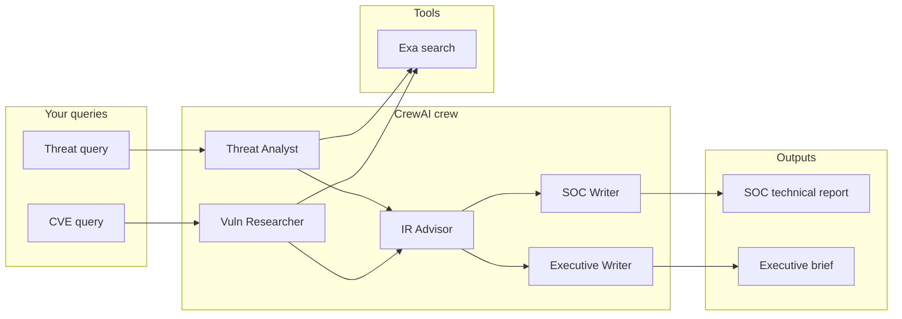

<div align="center">

# 🛡️ CyberSec AI Agent

**Autonomous multi-agent threat intelligence — real-time research, SOC-grade technical reports, and C-suite briefs.**

[](https://www.python.org/)
[](https://www.crewai.com/)
[](https://groq.com/)
[](https://streamlit.io/)

*Powered by [Exa](https://exa.ai/) search, [Groq](https://console.groq.com/) inference, and [CrewAI](https://github.com/joaomdmoura/crewAI) sequential crews.*

</div>

---

## What it does

CyberSec AI Agent runs a **sequential crew** of five specialized agents that:

1. **Hunt threats** — web-scale search for current cybersecurity threats and campaigns.
2. **Research CVEs** — surfaces critical vulnerabilities, affected products, and remediation context.
3. **Plan response** — produces containment, hardening, and longer-term mitigation guidance.
4. **Write for the SOC** — consolidates everything into a structured technical threat intelligence report.
5. **Write for leadership** — translates risk into business, compliance, and decision-ready language.

Outputs are available as **Markdown** and **PDF** (where PDF export is supported in your environment).



---

## Why it exists

Security teams need **repeatable, sourced** briefings without manually stitching blogs, advisories, and CVE feeds. This project automates the *workflow*: search → analyze → respond → dual-audience reporting — while keeping the **LLM + search stack** easy to swap or extend.

---

## Tech stack

| Layer | Choice |
|--------|--------|
| **Agents & tasks** | [CrewAI](https://docs.crewai.com/) |
| **LLM** | Llama **3.3 70B** via Groq OpenAI-compatible API |
| **Search & summaries** | [Exa](https://exa.ai/) (`exa-py`) |
| **Web UI** | [Streamlit](https://streamlit.io/) (`app.py` → `backend.py`) |
| **PDF** | [markdown-pdf](https://pypi.org/project/markdown-pdf/) |
| **Config** | [python-dotenv](https://pypi.org/project/python-dotenv/) (`.env`) |

---

## Prerequisites

- **Python 3.10+** recommended  
- Accounts / keys for **[Groq](https://console.groq.com/)** and **[Exa](https://exa.ai/)**

---

## Quick start

### 1. Clone and enter the project

```bash
git clone <your-repo-url>
cd cybersec_ai_agent
```

### 2. Create a virtual environment

```bash
python -m venv .venv

# Windows (PowerShell)
.\.venv\Scripts\Activate.ps1

# macOS / Linux
source .venv/bin/activate
```

### 3. Install dependencies

```bash
pip install -r requirements.txt
```

### 4. Configure environment variables

Create a **`.env`** file in the project root:

```env
GROQ_API_KEY=your_groq_api_key_here
EXA_API_KEY=your_exa_api_key_here
```

Never commit real keys. The app checks for these before running the pipeline.

---

## How to run

### Streamlit dashboard (recommended)

Rich UI with sidebar queries, progress, dual tabs (Executive / Technical), and download buttons for Markdown and PDF.

```bash
streamlit run app.py
```

Then open the URL shown in the terminal (typically `http://localhost:8501`).

### Backend only (CLI)

Runs the full pipeline and writes `executive_brief.md` and `technical_report.md` to the current directory:

```bash
python backend.py
```

### Legacy script (`main.py`)

Standalone script that wires agents similarly, writes Markdown/PDF, and uses notebook-style display when run in an environment that supports it. Prefer **`backend.py`** or **`app.py`** for a cleaner split between logic and UI.

```bash
python main.py
```

### Jupyter

Use **`main.ipynb`** to experiment step-by-step with the same ideas.

---

## Project layout

```
cybersec_ai_agent/
├── app.py              # Streamlit UI (imports backend)
├── backend.py          # CrewAI crew, tools, run_pipeline(), PDF helpers
├── main.py             # Standalone crew script + file outputs
├── main.ipynb          # Notebook exploration
├── requirements.txt
├── README.md
└── .env                # Create locally — API keys (not in git)
```

---

## Agents at a glance

| Agent | Role |
|--------|------|
| **Threat Intelligence Analyst** | Searches and structures live threat intel. |
| **Vulnerability Researcher** | Focuses on CVEs, severity, and remediation signals. |
| **Incident Response Advisor** | Immediate, short-term, and strategic response steps. |
| **Cybersecurity Report Writer** | Full SOC-style technical report. |
| **Executive Report Writer** | Board-ready brief: risk, compliance, decisions. |

The UI surfaces short descriptions for each role under **“Meet the agents”**.

---

## Configuration tips

- **Queries** — In Streamlit, customize the *threat* and *CVE* search strings in the sidebar; defaults target recent, critical-style topics.
- **Rate limiting** — The backend uses a step callback with a delay between steps to reduce API pressure; adjust `RATE_LIMIT_DELAY_SECONDS` in `backend.py` if needed.
- **Model** — Default model id is set in `backend.py` as `LLM_MODEL` (Llama 3.3 70B versatile on Groq).

---

## Important disclaimer

This tool generates **AI-assisted** content using **retrieved web snippets**. It can be **wrong, incomplete, or out of date**. Do **not** treat outputs as legal, compliance, or incident-response instructions without human review. Always verify against primary sources (vendor advisories, NVD, your own telemetry). Use at your own risk.

---


